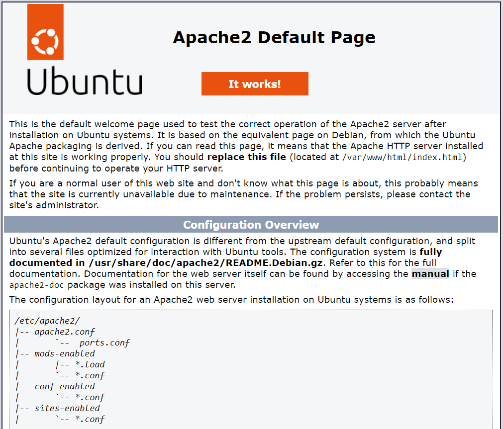

# Descoperirea puterii containerelor

## Intenție

Această experiență de laborator este gândită pentru a introduce utilizatorii în funcționarea OS-urilor Debian/Ubuntu și pentru a-i iniția în lumea Docker și a comenzilor sale fundamentale.

## Prezentare

Plecat de la imaginea oficială a sistemului de operare Ubuntu, vom construi un container ce va găzdui un server web Apache. Vom crea o pagină web simplă ce va afișa mesajul "Hello, World!" și vom testa accesarea acesteia într-un browser.

## Pași de urmat

**Crearea și Testarea Containerului:** 

docker run -ti -p 8000:80 --name containere03 ubuntu bash


- **Context:** Această comandă creează un container Docker bazat pe imaginea Ubuntu și deschide un terminal interactiv în acesta.
- **Rezultat:** Sunteți conectat la terminalul containerului, pregătit pentru a executa comenzi în cadrul acestuia.

În fereastra terminalului containerului, executați următoarele comenzi:

```bash
apt update
```

- **Scop:** Actualizează lista de pachete disponibile pentru instalare în interiorul containerului.
- **Rezultat:** Lista de pachete disponibile este actualizată, pregătind sistemul pentru instalarea Apache.

```bash
apt install apache2 -y
```

- **Scop:** Instalează serverul web Apache în container fără a solicita confirmare manuală (-y pentru a confirma automat).
- **Rezultat:** Apache este instalat și pregătit pentru pornire.

```bash
service apache2 start
```

- **Scop:** Pornirea serviciului Apache în container.
- **Rezultat:** Serverul web Apache este activat și pregătit pentru a servi conținut.

## Verificarea paginii web:

Deschideți un browser și accesați adresa [http://localhost:8000](http://localhost:8000). Ar trebui să vedeți pagina web implicită Apache.



- **Scop:** Verificați funcționarea serverului web Apache și conectivitatea la container.
- **Rezultat:** Pagina web implicită Apache este afișată în browser.

**Testarea Paginii Web:**

Deschidem un browser și accesăm adresa [http://localhost:8000](http://localhost:8000). Ar trebui să vedem pagina web implicită Apache.


- **Descriere:** Verificăm funcționalitatea serverului web Apache și conectivitatea la container.
- **Rezultat:** Vizualizăm pagina web implicită Apache în browser.

În continuare, vom executa următoarele comenzi în terminalul containerului:

ls -l /var/www/html/


- **Descriere:** Afișează conținutul directorului de bază al site-ului web Apache.
- **Rezultat:** Listă cu fișiere și directoare din directorul de bază al site-ului web Apache.

```bash
echo '<h1>Salutare, lume!</h1>' > /var/www/html/index.html
```

- **Descriere:** Creează un fișier HTML simplu care va afișa mesajul "Salutare, lume!" în directorul de bază al site-ului web Apache.
- **Rezultat:** Fișierul HTML index.html este creat sau actualizat cu mesajul specificat.

Reîmprospătăm pagina în browser. Ar trebui acum să vedem textul "Salutare, lume!" afișat pe pagină.


- **Descriere:** Verificăm funcționalitatea serverului web Apache și conținutul specificat în fișierul index.html.
- **Rezultat:** Vizualizăm mesajul "Salutare, lume!" pe pagina web în browser.

**Explorarea Configurării Apache: **
cd /etc/apache2/sites-enabled/


- **Descriere:** Schimbă directorul curent la configurarea site-urilor active pentru Apache.
- **Rezultat:** Navigăm către directorul de configurare a site-urilor active Apache.

```bash
cat 000-default.conf
```

- **Descriere:** Afișează conținutul fișierului de configurare pentru site-ul implicit Apache.
- **Rezultat:** Afișează configurarea site-ului implicit Apache în consolă.

- **Descriere:** Vizualizăm configurarea site-ului implicit Apache.
- **Rezultat:** Afișarea conținutului fișierului de configurare al site-ului implicit Apache în consolă.

**Finalizare și Curățare: **
docker ps -a


- **Descriere:** Afișează o listă a tuturor containerelor Docker, inclusiv cele oprite.
- **Rezultat:** Listă cu containere Docker în consolă.

Ștergem containerul creat anterior:

```bash
docker rm containers03
```

- **Descriere:** Șterge containerul Docker specificat.
- **Rezultat:** Containerul Docker este șters din sistemul gazdă.


- **Descriere:** Confirmarea ștergerii containerului.
- **Rezultat:** Confirmarea ștergerii containerului în consolă.
