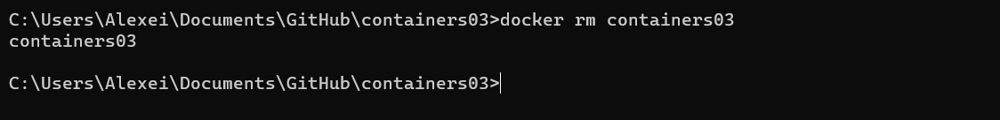

# Utilizarea containerelor ca medii de execuție

## Scopul

Această lucrare de laborator își propune să familiarizeze utilizatorii cu comenzile de bază ale OS Debian/Ubuntu și să ofere o introducere în Docker și comenzile sale de bază.

## Descriere

Pornind de la imaginea oficială a sistemului de operare Ubuntu, vom crea un container care va conține un server web Apache. Vom crea o pagină web simplă care va afișa textul "Hello, World!" și vom testa afișarea acesteia într-un browser.

## Instrucțiuni

1. **Pornirea și testarea:**

   Deschideți terminalul în directorul 'containers03' și executați următoarea comandă pentru a porni un container Ubuntu și a accesa terminalul său interactiv:

   ```bash
   docker run -ti -p 8000:80 --name containers03 ubuntu bash
   ```

   - **Scop:** Această comandă lansează un container Docker bazat pe imaginea Ubuntu și deschide un terminal interactiv în container.
   - **Rezultat:** Veți fi conectat la terminalul containerului, pregătit pentru a executa comenzi în interiorul său.

   În fereastra terminalului containerului, executați următoarele comenzi:

   ```bash
   apt update
   ```

   - **Scop:** Actualizează lista de pachete disponibile pentru instalare în interiorul containerului.
   - **Rezultat:** Lista de pachete disponibile este actualizată, pregătindu-vă pentru instalarea Apache.

   ```bash
   apt install apache2 -y
   ```

   - **Scop:** Instalează serverul web Apache în interiorul containerului fără a solicita confirmări manuale (-y pentru a confirma automat).
   - **Rezultat:** Apache este instalat și pregătit pentru a fi pornit.

   ```bash
   service apache2 start
   ```

   - **Scop:** Pornirea serviciului Apache în interiorul containerului.
   - **Rezultat:** Serverul web Apache este pornit și gata să servească conținut.

2. **Testarea paginii web:**

   Deschideți un browser și accesați adresa http://localhost:8000. Ar trebui să vedeți pagina web implicită Apache.

   

   - **Scop:** Verificarea funcționării serverului web Apache și a conectivității la container.
   - **Rezultat:** Vizualizarea paginii web implicite Apache în browser.

   În continuare, executați următoarele comenzi în terminalul containerului:

   ```bash
   ls -l /var/www/html/
   ```

   - **Scop:** Afișează conținutul directorului de rădăcină al site-ului web Apache.
   - **Rezultat:** Lista fișierelor și directoarelor din directorul de rădăcină al site-ului web Apache.

   ```bash
   echo '<h1>Hello, World!</h1>' > /var/www/html/index.html
   ```

   - **Scop:** Creează un fișier HTML simplu care va afișa textul "Hello, World!" în directorul de rădăcină al site-ului web Apache.
   - **Rezultat:** Fișierul HTML index.html este creat sau actualizat cu conținutul specificat.

   Reîmprospătați pagina în browser. Ar trebui acum să vedeți textul "Hello, World!" afișat pe pagină.

   

   - **Scop:** Verificarea funcționării serverului web Apache și a conținutului specificat în fișierul index.html.
   - **Rezultat:** Vizualizarea textului "Hello, World!" pe pagina web în browser.

3. **Explorarea configurării Apache:**

   Executați următoarele comenzi în terminalul containerului:

   ```bash
   cd /etc/apache2/sites-enabled/
   ```

   - **Scop:** Schimbă directorul de lucru către directorul de configurare a site-urilor activat Apache.
   - **Rezultat:** Navigarea către directorul de configurare a site-urilor Apache.

   ```bash
   cat 000-default.conf
   ```

   - **Scop:** Afișează conținutul fișierului de configurare pentru site-ul implicit Apache.
   - **Rezultat:** Afișează configurarea site-ului implicit Apache în consolă.

   - **Scop:** Vizualizarea configurării site-ului implicit Apache.
   - **Rezultat:** Afișarea conținutului fișierului de configurare al site-ului implicit Apache în consolă.

4. **Finalizare și curățare:**

   Închideți fereastra terminalului containerului cu comanda 'exit'.

   Afișați lista de containere Docker în terminalul gazdă:

   ```bash
   docker ps -a
   ```

   - **Scop:** Afișează o listă a tuturor containerelor Docker, inclusiv cele oprite.
   - **Rezultat:** Lista containerelor Docker în consolă.

   Ștergeți containerul creat anterior:

   ```bash
   docker rm containers03
   ```

   - **Scop:** Șterge containerul Docker specificat.
   - **Rezultat:** Containerul Docker este șters din sistemul gazdă.

   

   - **Scop:** Confirmarea ștergerii containerului.
   - **Rezultat:** Confirmarea ștergerii containerului în consolă.
